# 🌱 Spring Beans — The Complete Guide

Spring Beans are one of the foundational concepts of the Spring Framework. Nearly every major Spring feature — dependency injection, component scanning, configuration, lifecycle management — is built around them.

This guide walks through Beans from first principles to interview-ready mastery: what they are, how they're created and registered, how ambiguity between multiple Beans is resolved, and a complete worked example tying every concept together.


---

## Contents

- [What Is a Spring Bean?](#what-is-a-spring-bean)
- [Java Object vs. Spring Bean](#java-object-vs-spring-bean)
- [What Does "Managed by Spring" Actually Mean?](#what-does-managed-by-spring-actually-mean)
- [Who Creates a Bean: Java or Spring?](#who-creates-a-bean-java-or-spring)
- [Bean Definition: The Blueprint](#bean-definition-the-blueprint)
- [Bean Definition vs. Bean](#bean-definition-vs-bean)
- [How Bean Registration Works](#how-bean-registration-works)
- [@Component and the Problem It Solves](#component-and-the-problem-it-solves)
- [Component Scanning](#component-scanning)
- [Stereotype Annotations](#stereotype-annotations)
- [@Bean](#bean)
- [Why Does @Bean Exist?](#why-does-bean-exist)
- [@Bean Returning an Interface Type](#bean-returning-an-interface-type)
- [@Configuration](#configuration)
- [@Component vs. @Bean](#component-vs-bean)
- [Dependencies Inside @Bean Methods](#dependencies-inside-bean-methods)
- [Bean Naming](#bean-naming)
- [getBean() Lookup](#getbean-lookup)
- [Multiple Beans of the Same Type](#multiple-beans-of-the-same-type)
- [@Primary](#primary)
- [@Qualifier](#qualifier)
- [Full vs. Lite Configuration](#full-vs-lite-configuration)
- [@Component vs @Bean: Quick Comparison Table](#component-vs-bean-quick-comparison-table)
- [Common Mistakes to Avoid](#common-mistakes-to-avoid)
- [Why Constructor Injection Is Preferred](#why-constructor-injection-is-preferred)
- [Worked Example: Order Payment System](#worked-example-order-payment-system)
- [The Mental Model](#the-mental-model)
- [Interview Prep](#interview-prep)
- [Quick Reference Card](#quick-reference-card)

---

## What Is a Spring Bean?

A **Spring Bean** is an object whose creation, configuration, dependency wiring, and lifecycle are handled by the Spring IoC (Inversion of Control) container.

In plain terms:

> A Spring Bean is an object that is registered with, and managed by, the Spring container.

Compare plain Java object wiring...

```java
EmailService emailService = new EmailService();
OrderService orderService = new OrderService(emailService);
```

...where the *developer* is responsible for creating both objects and wiring them together, with what Spring does instead:

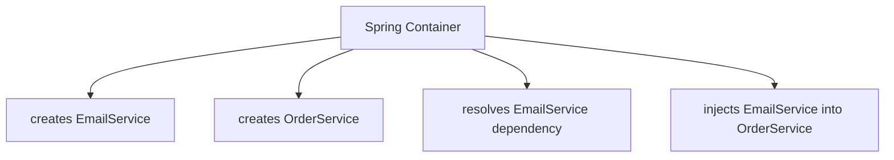

Spring takes over creation, resolution, and injection — the container becomes responsible for the wiring, not the developer.

[⬆ Back to top](#contents)

---

## Java Object vs. Spring Bean

Every Spring Bean is a Java object — but **not every Java object is a Spring Bean**.

```java
PaymentClient client = new PaymentClient(); // just a plain Java object
```

Spring knows nothing about this object unless it's registered via a **Bean definition**:

```java
@Configuration
public class AppConfig {

    @Bean
    public PaymentClient paymentClient() {
        return new PaymentClient();
    }
}
```

| | Plain Java object | Spring Bean |
|---|---|---|
| Created by | `new PaymentClient()` directly | Container, via a Bean definition |
| Known to Spring? | No | Yes |
| Lifecycle managed? | No | Yes |

[⬆ Back to top](#contents)

---

## What Does "Managed by Spring" Actually Mean?

When Spring "manages" a Bean, the container takes responsibility for things like:

- Bean creation
- Dependency resolution & injection
- Bean registration and configuration
- Initialization / destruction callbacks
- Scope behavior

It does **not** mean Spring intercepts every method call. Business logic still runs as ordinary Java:

```java
orderService.placeOrder(); // executed normally by the JVM — Spring isn't "in" this call
```

[⬆ Back to top](#contents)

---

## Who Creates a Bean: Java or Spring?

Two levels of truth:

- **At the JVM level:** the Java runtime ultimately allocates and constructs the object.
- **At the application level:** Spring controls *when* and *how* that construction happens as part of Bean creation, and manages the resulting object afterward.

> **Interview-ready answer:** "The Java runtime ultimately creates the Java object, while Spring controls the Bean creation process and manages the resulting object through the IoC container."

[⬆ Back to top](#contents)

---

## Bean Definition: The Blueprint

Before Spring can manage a Bean, it needs *information about it* — a **Bean Definition**. Think of it like a recipe that produces a cake:


A Bean Definition typically carries:

- Bean class / type
- Bean name
- Dependencies
- Configuration metadata
- Initialization info and other container metadata

**A Bean Definition is not the Bean itself — it's the metadata that produces one.**

[⬆ Back to top](#contents)

---

## Bean Definition vs. Bean

| Term | Meaning |
|---|---|
| **Bean Definition** | Metadata describing how Spring should define/manage an object |
| **Bean** | The actual object instance managed by the container |

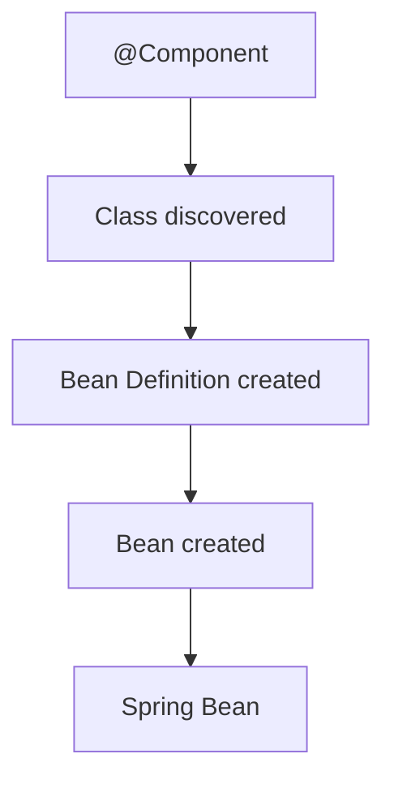

**Bean Definition ≠ Bean.**

[⬆ Back to top](#contents)

---

## How Bean Registration Works

```java
@Component
public class EmailService {
    public void sendEmail() {
        System.out.println("Sending email");
    }
}
```

`@Component` makes the class a *candidate* for component scanning — Spring can discover it:

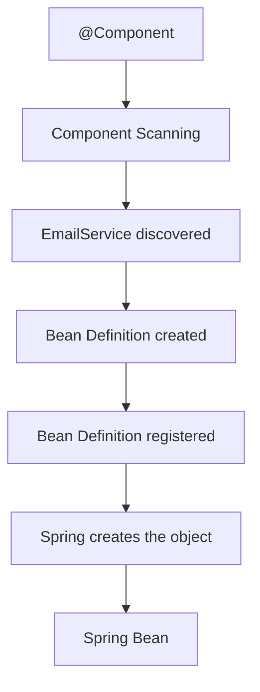

Registration isn't "putting an object into a list" — it's Spring recording Bean *metadata* in its internal registry.

[⬆ Back to top](#contents)

---

## @Component and the Problem It Solves

`@Component` marks a class as a candidate for automatic component scanning. Without it, every class needs manual, repetitive configuration:

```java
@Configuration
public class AppConfig {

    @Bean
    public EmailService emailService() {
        return new EmailService();
    }

    @Bean
    public OrderService orderService(EmailService emailService) {
        return new OrderService(emailService);
    }
}
```

With `@Component`, Spring discovers the class automatically:

```java
@Component
public class EmailService {
    public void sendEmail() {
        System.out.println("Sending email");
    }
}
```

[⬆ Back to top](#contents)

---

## Component Scanning

`@ComponentScan` tells Spring *where* to look:

```java
@Configuration
@ComponentScan("com.learning.spring.beans")
public class AppConfig {
}
```

```text
com.learning.spring.beans
 ├── OrderService
 ├── EmailService
 ├── PaymentService
 └── payment
      └── StripeService
```

If a class lives outside the scanned package (and isn't registered some other way), Spring simply won't find it.

[⬆ Back to top](#contents)

---

## Stereotype Annotations

Spring ships several specialized annotations that all participate in scanning, while also signaling architectural intent:

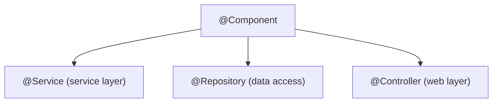

```java
@Service
public class OrderService { }

@Repository
public class OrderRepository { }

@Controller
public class OrderController { }
```

[⬆ Back to top](#contents)

---

## @Bean

`@Bean` is an **explicit, method-oriented** way to register an object:

```java
@Configuration
public class AppConfig {

    @Bean
    public EmailService emailService() {
        return new EmailService();
    }
}
```

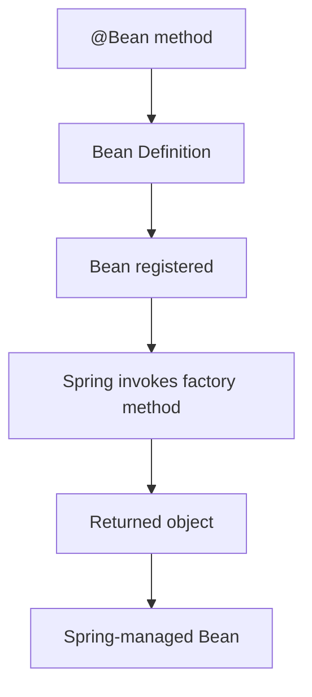

[⬆ Back to top](#contents)

---

## Why Does @Bean Exist?

It gives explicit control where `@Component` can't help — most commonly:

- **Third-party classes** you don't own the source of (can't add `@Component`)
- Custom / explicit construction logic
- Multiple differently-configured instances
- Infrastructure objects
- Choosing a specific implementation of an interface

```java
@Configuration
public class AppConfig {

    @Bean
    public ObjectMapper objectMapper() {
        return new ObjectMapper();
    }
}
```

[⬆ Back to top](#contents)

---

## @Bean Returning an Interface Type

```java
public interface PaymentGateway {
    void pay();
}

public class StripePaymentGateway implements PaymentGateway {
    @Override
    public void pay() {
        System.out.println("Stripe payment");
    }
}

@Configuration
public class AppConfig {

    @Bean
    public PaymentGateway paymentGateway() {
        return new StripePaymentGateway();
    }
}
```

Exposing the **interface** type lets consumers depend on the abstraction rather than a concrete class.

[⬆ Back to top](#contents)

---

## @Configuration

Marks a class as a source of Spring configuration, typically holding multiple `@Bean` methods:

```java
@Configuration
public class AppConfig {

    @Bean
    public EmailService emailService() { return new EmailService(); }

    @Bean
    public SmsService smsService() { return new SmsService(); }

    @Bean
    public NotificationService notificationService() { return new NotificationService(); }
}
```

[⬆ Back to top](#contents)

---

## @Component vs. @Bean

| | `@Component` | `@Bean` |
|---|---|---|
| **Orientation** | Class-oriented — "discover this class" | Method-oriented — "use this method to produce this object" |
| **Best for** | Classes your application owns | Third-party or explicitly-configured objects |
| **Discovery** | Component scanning | No scanning needed |

**Rule of thumb** (a guideline, not a hard rule):

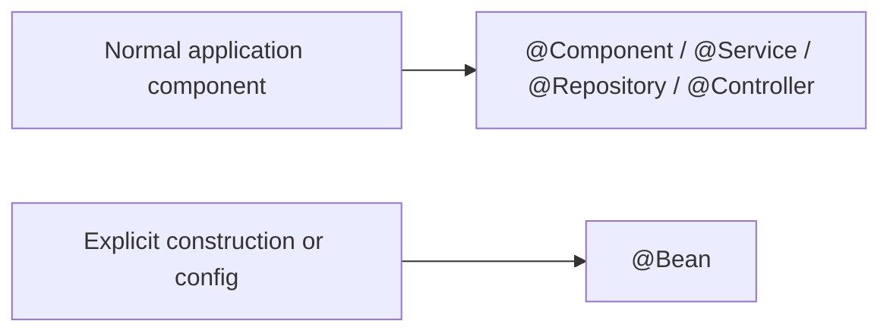

`@Bean` can still be used for application-owned classes when explicit configuration is genuinely useful.

[⬆ Back to top](#contents)

---

## Dependencies Inside @Bean Methods

```java
@Configuration
public class AppConfig {

    @Bean
    public NotificationService notificationService() {
        return new EmailNotificationService();
    }

    @Bean
    public OrderService orderService(NotificationService notificationService) {
        return new OrderService(notificationService);
    }
}
```

Spring resolves `NotificationService` and *passes* it into the factory method — the method itself then hands it to the constructor. This is subtly different from Spring directly performing constructor injection via component scanning; here, the `@Bean` method is the intermediary.

[⬆ Back to top](#contents)

---

## Bean Naming

| Source | Default name | How to override |
|---|---|---|
| `@Bean public PaymentClient paymentClient()` | `paymentClient` (from method name) | `@Bean(name = "ordersPaymentClient")` |
| `@Component class EmailNotificationService` | `emailNotificationService` (from class name) | `@Component("emailNotifier")` |

**Three distinct concepts — don't conflate them:**

```java
PaymentClient paymentClient =              // ① Java variable name
    context.getBean(
        "ordersPaymentClient",             // ② Bean name
        PaymentClient.class);              // ③ Java type
```

[⬆ Back to top](#contents)

---

## getBean() Lookup

```java
// By type
PaymentClient paymentClient = context.getBean(PaymentClient.class);

// By name + type (preferred over name-only)
PaymentClient paymentClient =
    context.getBean("ordersPaymentClient", PaymentClient.class);

// By name only (returns Object — needs a cast)
Object bean = context.getBean("ordersPaymentClient");
```

| Lookup style | Meaning |
|---|---|
| **Type lookup** | "Find *the* Bean of this type." |
| **Name + type lookup** | "Find *this specific* Bean, and confirm it matches this type." |

[⬆ Back to top](#contents)

---

## Multiple Beans of the Same Type

Spring allows multiple Beans of the same Java type:

```java
@Configuration
public class AppConfig {

    @Bean
    public PaymentClient ordersPaymentClient() {
        return new PaymentClient("https://payment-api.com");
    }

    @Bean
    public PaymentClient refundsPaymentClient() {
        return new PaymentClient("https://refund-api.com");
    }
}
```

These are two **distinct** objects (`ordersClient == refundsClient` → `false`), useful for cases like:

- Separate payment vs. refund API clients
- Primary vs. reporting databases
- Multiple implementations of one interface

The problem isn't having multiple Beans — it's when Spring **can't tell which one you want**:

```java
PaymentClient client = context.getBean(PaymentClient.class);
// ❌ throws NoUniqueBeanDefinitionException — two matching candidates exist
```

[⬆ Back to top](#contents)

---

## @Primary

Marks a Bean as the **preferred default** when multiple candidates match:

```java
@Bean
@Primary
public PaymentClient ordersPaymentClient() {
    return new PaymentClient("https://payment-api.com");
}

@Bean
public PaymentClient refundsPaymentClient() {
    return new PaymentClient("https://refund-api.com");
}
```

`@Primary` does **NOT**:

- ❌ Delete or disable other Beans
- ❌ Make other Beans unavailable
- ❌ Make one Bean "technically better"
- ❌ Restrict how many Beans can exist

It only sets a **preferred candidate** for ambiguous resolution.

[⬆ Back to top](#contents)

---

## @Qualifier

Gives Spring an *explicit* instruction on which candidate to use:

```java
public OrderService(
        @Qualifier("ordersPaymentClient") PaymentClient paymentClient) {
    this.paymentClient = paymentClient;
}
```

> **`@Qualifier` does not create a Bean.** The Bean must already exist — the qualifier just selects among existing candidates.

| | `@Primary` | `@Qualifier` |
|---|---|---|
| Role | "Use this as the default." | "Use *this specific one*." |
| Specificity | Fallback preference | Explicit, wins over `@Primary` |

Used together:

```java
@Bean
@Primary
public PaymentGateway stripePaymentGateway() {
    return new StripePaymentGateway();
}

@Bean
public PaymentGateway razorpayPaymentGateway() {
    return new RazorpayPaymentGateway();
}
```

```java
// Uses the primary (Stripe) automatically
public OrderService(PaymentGateway paymentGateway) { }

// Explicitly overrides to Razorpay
public OrderService(
        @Qualifier("razorpayPaymentGateway") PaymentGateway paymentGateway) { }
```

[⬆ Back to top](#contents)

---

## Full vs. Lite Configuration

```java
@Configuration
public class AppConfig {

    @Bean
    public PaymentClient paymentClient() {
        return new PaymentClient("https://payment-api.com");
    }

    @Bean
    public OrderService orderService() {
        return new OrderService(paymentClient()); // calling another @Bean method
    }
}
```

A **full** `@Configuration` class gets special CGLIB-based processing so that calling `paymentClient()` from within `orderService()` **does not create a second object** — it returns the same container-managed Bean:

```java
PaymentClient paymentClient = context.getBean(PaymentClient.class);
OrderService orderService = context.getBean(OrderService.class);
PaymentClient orderPaymentClient = orderService.getPaymentClient();

System.out.println(paymentClient == orderPaymentClient); // true
```

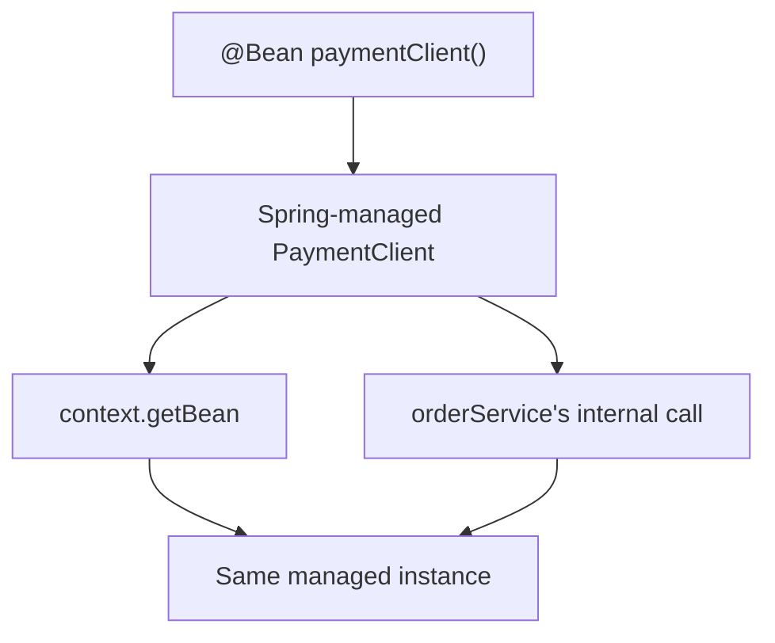

A plain `@Component` class with `@Bean` methods does **not** get this special processing — it's "lite" mode, and inter-method calls behave like ordinary Java calls (each returning a *new* object).

**Preferred style regardless:** pass dependencies as explicit parameters rather than relying on inter-method calls —

```java
@Bean
public OrderService orderService(PaymentClient paymentClient) {
    return new OrderService(paymentClient);
}
```

This makes the dependency visible directly in the method signature.

[⬆ Back to top](#contents)

---

## @Component vs @Bean: Quick Comparison Table

| Feature | `@Component` | `@Bean` |
|---|---|---|
| Target | Class | Method |
| Registration style | Automatic discovery | Explicit |
| Requires scanning | Usually, yes | No |
| Common use | Application classes | Explicit / third-party configuration |
| Third-party classes | Usually can't annotate | Excellent fit |
| Custom construction | Less explicit | Very explicit |
| Multiple configurations | Possible, less direct | Very convenient |

[⬆ Back to top](#contents)

---

## Common Mistakes to Avoid

| Mistake | Correction |
|---|---|
| "`@Component` directly creates the object." | It marks a scanning candidate; Spring discovers, registers, and *then* creates it. |
| "Every Java object in a Spring app is a Bean." | Only objects registered with the container are Beans — `new SomeObject()` is not automatically one. |
| Manually `new`-ing a dependency Spring should manage (`this.paymentService = new PaymentService();`) | Use constructor injection so Spring supplies the managed instance. |
| Forgetting to include a package in component scanning | Result: `NoSuchBeanDefinitionException` or similar — the class was never discovered. |
| Using both `@Component` and a `@Bean` method for the *same* class | Creates duplicate/ambiguous Beans — pick one registration approach. |
| Forgetting multiple Beans can cause ambiguity | Resolve with `@Primary` and/or `@Qualifier`. |
| Marking *several* candidates `@Primary` | Doesn't resolve ambiguity — there should be one clear default. |
| "`@Qualifier` creates a Bean." | It only *selects* among Beans that already exist. |
| Confusing the Bean name with the Java variable name | They're independent — see [Bean Naming](#bean-naming). |
| Overusing `context.getBean()` inside business code | Prefer constructor injection; don't couple business classes to the container. |
| Putting business logic inside `@Configuration` classes | Configuration classes should describe configuration, not application logic. |
| "Spring executes my business logic." | Spring creates and wires Beans; your code still executes its own methods normally. |

[⬆ Back to top](#contents)

---

## Why Constructor Injection Is Preferred

```java
@Component
public class OrderService {

    private final PaymentService paymentService;

    public OrderService(PaymentService paymentService) {
        this.paymentService = paymentService;
    }
}
```

Constructor injection makes dependencies:

- **Explicit** — visible right in the signature
- **Required** — the object can't exist in a half-wired state
- **Testable** — easy to pass mocks/fakes directly
- **Immutable** — works naturally with `final` fields
- **Container-independent** — the class doesn't need to know about `getBean()`

[⬆ Back to top](#contents)

---

## Worked Example: Order Payment System

This example ties every concept together: multiple `PaymentGateway` implementations, multiple `PaymentClient` configurations, `@Primary`, `@Qualifier`, `@Component`, `@Bean`, and `@Configuration`.

**The abstraction**

```java
public interface PaymentGateway {
    void pay(double amount);
}
```

**The implementations** (plain classes — registered via `@Bean`, not `@Component`)

```java
public class StripePaymentGateway implements PaymentGateway {

    private final PaymentClient paymentClient;

    public StripePaymentGateway(PaymentClient paymentClient) {
        this.paymentClient = paymentClient;
    }

    @Override
    public void pay(double amount) {
        paymentClient.processPayment(amount);
        System.out.println("Payment processed through Stripe");
    }
}

public class RazorpayPaymentGateway implements PaymentGateway {

    private final PaymentClient paymentClient;

    public RazorpayPaymentGateway(PaymentClient paymentClient) {
        this.paymentClient = paymentClient;
    }

    @Override
    public void pay(double amount) {
        paymentClient.processPayment(amount);
        System.out.println("Payment processed through Razorpay");
    }
}
```

**The infrastructure class**

```java
public class PaymentClient {

    private final String baseUrl;

    public PaymentClient(String baseUrl) {
        this.baseUrl = baseUrl;
    }

    public void processPayment(double amount) {
        System.out.println("Calling payment API: " + baseUrl + " | Amount: " + amount);
    }

    public String getBaseUrl() {
        return baseUrl;
    }
}
```

**The consuming service** (application-owned → `@Component`)

```java
@Component
public class OrderService {

    private final PaymentGateway paymentGateway;

    public OrderService(@Qualifier("stripePaymentGateway") PaymentGateway paymentGateway) {
        this.paymentGateway = paymentGateway;
    }

    public void placeOrder(double amount) {
        System.out.println("Creating order...");
        paymentGateway.pay(amount);
        System.out.println("Order placed successfully");
    }
}
```

**The configuration**

```java
@Configuration
@ComponentScan("com.learning.spring.beans")
public class AppConfig {

    @Bean
    @Primary
    public PaymentGateway stripePaymentGateway(PaymentClient stripePaymentClient) {
        return new StripePaymentGateway(stripePaymentClient);
    }

    @Bean
    public PaymentGateway razorpayPaymentGateway(PaymentClient razorpayPaymentClient) {
        return new RazorpayPaymentGateway(razorpayPaymentClient);
    }

    @Bean(name = "stripePaymentClient")
    public PaymentClient stripePaymentClient() {
        return new PaymentClient("https://api.stripe.com");
    }

    @Bean(name = "razorpayPaymentClient")
    public PaymentClient razorpayPaymentClient() {
        return new PaymentClient("https://api.razorpay.com");
    }
}
```

**Main**

```java
public class Main {

    public static void main(String[] args) {
        ApplicationContext context =
            new AnnotationConfigApplicationContext(AppConfig.class);

        OrderService orderService = context.getBean(OrderService.class);
        orderService.placeOrder(1500);

        System.out.println();
        PaymentGateway defaultGateway = context.getBean(PaymentGateway.class);
        System.out.println("Default PaymentGateway: " + defaultGateway.getClass().getSimpleName());

        System.out.println();
        PaymentGateway razorpayGateway =
            context.getBean("razorpayPaymentGateway", PaymentGateway.class);
        System.out.println("Named PaymentGateway: " + razorpayGateway.getClass().getSimpleName());
    }
}
```

**Expected output**

```text
Creating order...
Calling payment API: https://api.stripe.com | Amount: 1500.0
Payment processed through Stripe
Order placed successfully

Default PaymentGateway: StripePaymentGateway

Named PaymentGateway: RazorpayPaymentGateway
```

**The dependency graph**

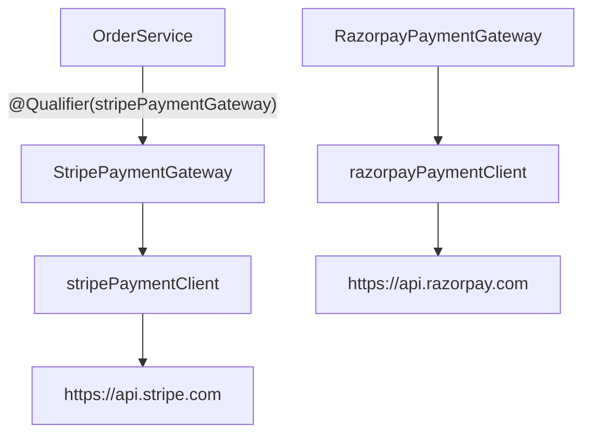

**Who creates / registers what?**

| Bean | Registered via | Notes |
|---|---|---|
| `OrderService` | `@Component` + scanning | Application-owned class |
| `StripePaymentGateway` | `@Bean stripePaymentGateway(...)` | Not `@Component` — third-party-style explicit registration |
| `RazorpayPaymentGateway` | `@Bean razorpayPaymentGateway(...)` | Same pattern |
| `PaymentClient` ×2 | `@Bean(name="stripePaymentClient")` / `@Bean(name="razorpayPaymentClient")` | Two distinct instances of the same type |

**Who injects what?**

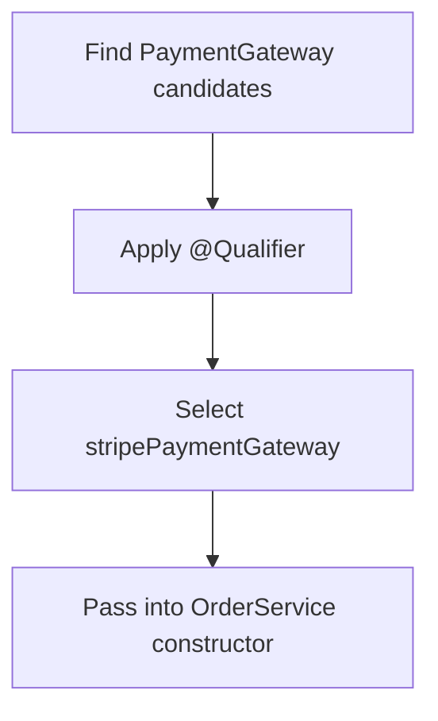

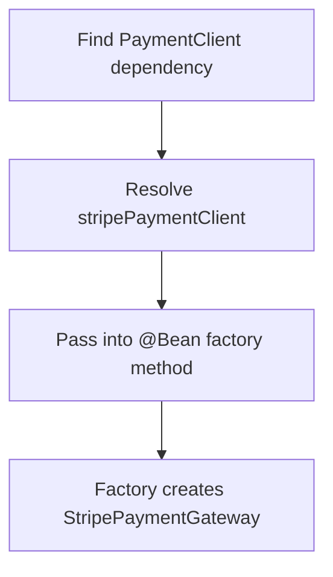

[⬆ Back to top](#contents)

---

## The Mental Model

**The full registration → injection pipeline**

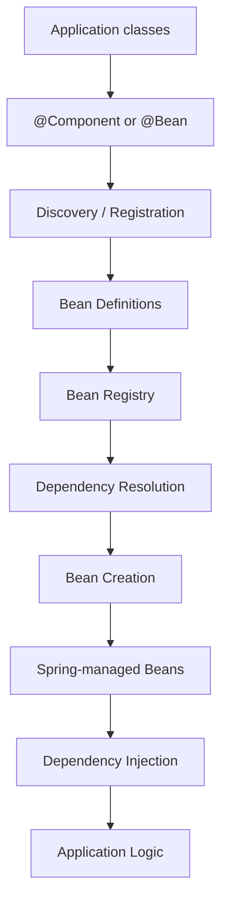

**Concept map**

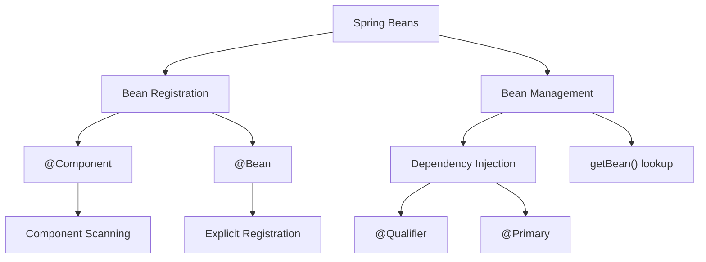

[⬆ Back to top](#contents)

---

## Interview Prep

### Basic

**What is a Spring Bean?**
An object whose creation, configuration, dependency wiring, and management are handled by the Spring IoC container.

**Is every Java object a Spring Bean?**
No — only objects registered with the container as Beans are Spring-managed.

**What is a Bean Definition?**
Metadata describing how Spring should define and manage a Bean: type, name, dependencies, configuration, and other container metadata.

**What does `@Component` do?**
Marks a class as a component-scanning candidate so Spring can discover and register it as a Bean.

**What does `@Bean` do?**
Tells Spring that the object returned by a method should be registered and managed as a Bean.

**What is `@Configuration`?**
Marks a class as a source of Spring configuration, typically containing `@Bean` methods.

### Intermediate

**Difference between `@Component` and `@Bean`?**
`@Component` is class-oriented and relies on scanning; `@Bean` is method-oriented and gives explicit control over object creation.

**When would you use `@Bean` instead of `@Component`?**
Third-party classes, explicit construction, custom configuration, multiple differently-configured instances, infrastructure objects, or selecting a specific implementation.

**Default Bean name for `@Bean public PaymentClient paymentClient()`?**
`paymentClient` — derived from the method name.

**Default Bean name for `@Component class EmailService`?**
`emailService` — the lower-camel-case class name.

**Can multiple Beans share the same Java type?**
Yes — e.g. `stripePaymentClient` and `razorpayPaymentClient`, both of type `PaymentClient`.

**What happens when multiple Beans match a dependency?**
Spring needs disambiguation — via `@Primary` and/or `@Qualifier` — or it throws `NoUniqueBeanDefinitionException`.

**What is `@Primary`?**
Marks a Bean as the preferred candidate when multiple Beans match and no more specific selection is given.

**What is `@Qualifier`?**
Provides explicit selection information for choosing a particular Bean during injection.

**Which is more specific: `@Primary` or `@Qualifier`?**
`@Qualifier` — a matching qualifier always wins over the default primary preference.

### Scenario-based

**Three `PaymentGateway` implementations exist — how do you inject a specific one?**
Use `@Qualifier("stripePaymentGateway")` on the constructor parameter.

**Multiple implementations exist, but you want one as the default — what do you use?**
`@Primary` on the preferred Bean.

**Can multiple `@Bean` methods return the same type?**
Yes — each is a distinct Bean definition and object.

**Why avoid using both `@Component` and `@Bean` for the same class?**
It risks registering duplicate Beans of the same type, causing ambiguity and confusing configuration.

**What happens calling `getBean(PaymentGateway.class)` with two matching, non-primary Beans?**
Spring throws `NoUniqueBeanDefinitionException`.

### Two "explain it well" questions

**"Explain how Spring creates and injects a Bean."**
> Spring first discovers Bean definitions — through component scanning or explicit `@Bean` configuration — and registers them with the IoC container. The container then resolves dependencies and creates the required objects. Those objects become Spring-managed Beans and are injected into dependent components according to the configured resolution rules (type, `@Primary`, `@Qualifier`).

**"Who creates the object — Java or Spring?"**
> The Java runtime ultimately allocates and constructs the object, but Spring controls the Bean creation process at the container level and manages the resulting object as a Bean.

[⬆ Back to top](#contents)

---

## Quick Reference Card

| Concept | One-line definition |
|---|---|
| **Spring Bean** | An object managed by the Spring IoC container |
| **Bean Definition** | Metadata describing how to define/manage a Bean |
| **`@Component`** | Marks a class as a component-scanning candidate |
| **`@Bean`** | Explicitly registers a method's return value as a Bean |
| **`@Configuration`** | Marks a class as a configuration source |
| **Component Scanning** | Automatically discovers eligible classes |
| **Bean Naming** | Identifier for a Bean within the container |
| **Multiple Beans** | Spring can manage several Beans of the same type |
| **`@Primary`** | Establishes the preferred default candidate |
| **`@Qualifier`** | Explicitly selects a specific candidate |
| **`getBean()`** | Explicit, manual Bean retrieval from the container |

**The single most important flow to remember:**

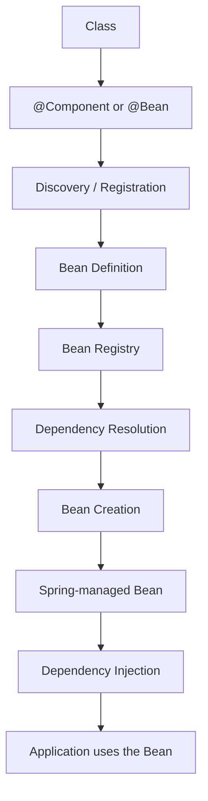

> **Bottom line:** Spring Beans aren't primarily about annotations — they're about objects being registered with, and managed by, the Spring IoC container, with Spring resolving and injecting their dependencies for you.

[⬆ Back to top](#contents)